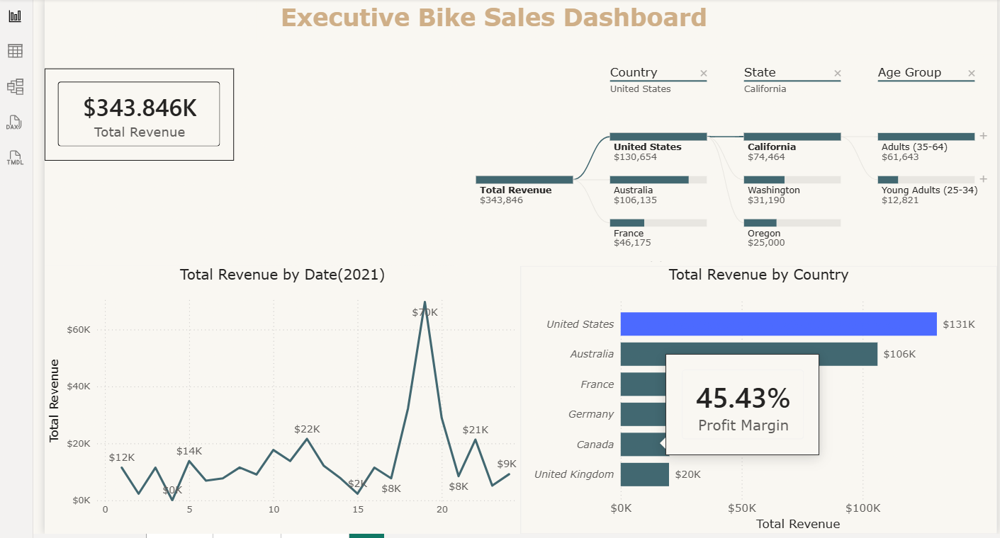

## Project 2: Executive Bike Sales Analysis

### Overview

An executive Power BI dashboard developed to analyze bike sales performance, revenue, profit, customer demographics, and geographical distribution.

### Objective

The objective of this project is to provide executives with a clear overview of total revenue, profit, sales trends, customer segments, and regional performance.

### Tools Used

- Power BI
- DAX
- Power Query
- Data Modeling
- Data Visualization

### Key Insights

- Total Revenue: $343.85K
- Profit: $134.43K
- Profit Margin: 45.43%
- The United States generated the highest revenue.
- California was the top-performing state.
- Adults aged 35–64 represented the primary customer segment.
- Revenue and profit trends were analyzed by country, state, age group, and gender.

### Dashboard Preview

